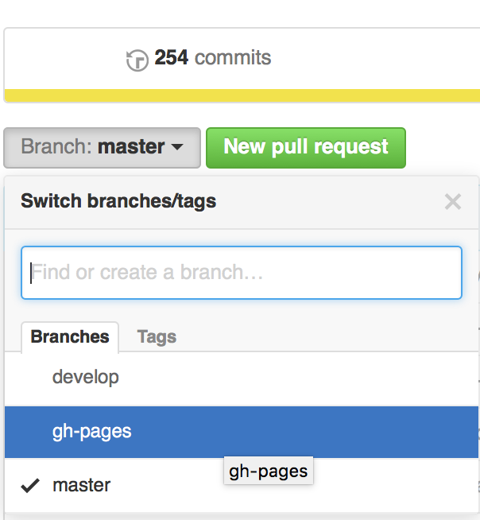

Hackfoldr 2.0 教學 - 架設自己的 Hackfoldr
===

*In other languages:*

- [English tutorial](https://github.com/hackfoldr/hackfoldr-2.0-forkme/blob/master/docs/Hosting%20your%20own%20Hackfoldr%202.0.md)
- [中文版](https://github.com/hackfoldr/hackfoldr-2.0-forkme/blob/master/docs/Hosting%20your%20own%20Hackfoldr%202.0%20zh-tw.md)

## Hackfoldr 是什麼

Hackfoldr 讓你在協作開源專案時，方便收集散落網路各地的文件。

範例 folder： http://beta.hackfoldr.org/hackfolder_template

### 如何運作

Hackfoldr 使用 ethercalc.org 的線上表單來動態收集內容，表單中的每一行都代表一個連結。你還可以設定連結要開新分頁、子資料夾、或標上彩色標籤。

## 白牌打包

### 自架 hackfoldr 的好處

- 使用自己的網址，自訂 folder 首頁的預設內容

    例如： http://beta.hackfoldr.org/ 連結到  ethercalc.org/welcome-to-hackfoldr   
    而 http://folder.moztw.org/ 連結到 ethercalc.org/moztw ，收集所有關於 MozTW 社群的文件

- 可打開隱藏的快捷選單，把常用連結內建到 hackfoldr 導覽列
- 可自訂關聯的 hackpad 站台

## 步驟 ##

### 第零步

你需要下列東西以繼續架設自己的 hackfoldr

- 準備好一個網址
- 擁有一個 github 帳號

### fork github repo

1. 到 https://github.com/hackfoldr/hackfoldr-2.0-forkme 

2. 按右上角的 Fork 按鈕

### 修改 CNAME 檔案

1. 先打開你剛 fork 的全新 github 專案頁面

2. 從左上的 Branch 下拉選單，切換到 `gh-pages` 分支

	我們使用 github 的 project page，而不是 user page 或 organization page，所以顯示成頁面的分支是 gh-pages，而不是 master  

3. 點開根目錄的 CNAME 檔案

4. 點選右上角的「鉛筆」按鈕編輯 CNAME 檔案內容

5. 將內容改成你欲使用的網址

   請確定此檔案內只包含單一行網址，範例： https://github.com/hackfoldr/hackfoldr-2.0/blob/gh-pages/CNAME

### 使用域名管理服務 (DNS) 設定網址

- 例如 amazon 的 router 53

        name: _YOUR_DOMAIN_NAME_.
        type: CNAME
        value: _YOUR_GITHUB_REPO_NAME_.github.io 
        evaluate target: -
        health check id: -
        ttl: 300
  
  範例      

        name: hack.etblue.tw.
        type: CNAME
        value: etblue.github.io
        evaluate target: -
        health check id: -
        ttl: 300   

- 假若是 cloudflare

  - 設定 `Cname` 到 `etblue.github.io`
  - 設定 `Page Rule`，
    `http://etblue.github.io/+` forward到 `http://etblue.github.io`

  [Cloudflare guide]( http://blog.cloudflare.com/introducing-pagerules-url-forwarding/)

### 自訂你的 hackfoldr

1. 複製 [ethercalc 範例表單](https://ethercalc.org/hackfolder_template) 到一個你喜歡的新網址去

2. 打開你的 repo，切換到 `gh-pages` 分支

3. 打開 `index.html` 檔案，按鉛筆按鈕編輯  

   畫面會類似這樣： https://github.com/hackfoldr/hackfoldr-2.0/blob/gh-pages/index.html

4. 依樣畫葫蘆做這幾件事情

    - 設定你的 [defult foldr id 指向到新的 etherpad 網址](https://github.com/moztw/hackfoldr-moztw/commit/73f712e028f7dd446750dde4aa9e90cda4a48bda)

      **重要！** 請務必要設定自己的預設 folder，不要直接把 welcome-to-hackfoldr 這份 ethercalc 的資料改掉，不然大家都沒有教學文件可以看啦 >_<

    - 設定你的 [Github repo issue 回報處](https://github.com/moztw/hackfoldr-moztw/commit/a08f238e2e32b61273827943b1d3b4f5f21c67ab)

    - 設定[預設使用的 hackpad 站台](https://github.com/moztw/hackfoldr-moztw/commit/ccb57c3541c2ba370161bae7a3683a99a861dfe4)

    - [將剛才在 index.html 的修改全數複製到 404.html](https://github.com/moztw/hackfoldr-moztw/commit/dba706726b0cb0004e74ad9ff5cf9a816367deb8)（直接整份檔案複製貼上即可）

### 完成了！ 

現在只需要耐心等待域名生效。一般來說不會太久，十分鐘之類的，除非 TTL 設定成超長時間。

## 開發

請參考 [這份文件](https://github.com/hackfoldr/hackfoldr-2.0-forkme/blob/master/docs/Developing%20Hackfoldr%202.0%20zh-tw.md) 或 [README](https://github.com/hackfoldr/hackfoldr-2.0-forkme/blob/master/README.md) 來貢獻本專案。

